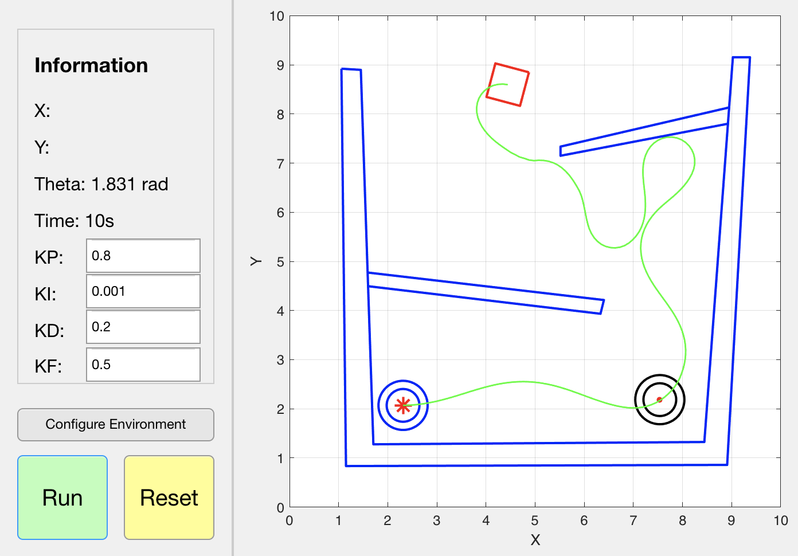
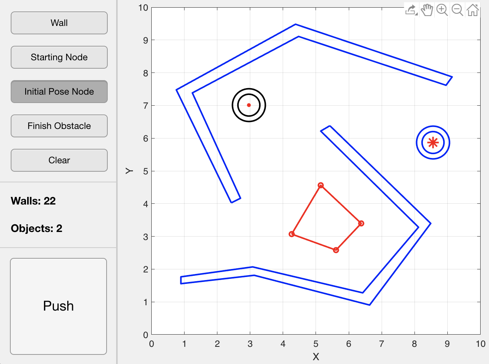

# 2086-WallFollower
[Report documenting our work and results](https://www.overleaf.com/read/zbrfjkpjqtcb)

This is a MATLAB project that simulates a 2D robot with LIDAR as an extroceptive
input and applies a wall following PID algorithm to reach an end desired position.
The project will deliver a 2D visualization of a robot with self-optimizing
parameters for a PID algorithm moving along a wall at a fixed distance offset
in a user interactable field.

## Robot's Attributes

### Sensor Data

The main sensor used in this simulation is a LIDAR sensor mounted on the center of
the robot. The data input is an array of values ranging from [-pi/2, pi/2], more
specifically the front of the robot is at the angle 0 and the robot follows the
generic right-handed 3D coordinate frame.

### Ackerman Drive

The robot we are modeling uses the so called [Ackermann steering geometry](https://en.wikipedia.org/wiki/Ackermann_steering_geometry). The modelled geometric
assembly causes the robots drive to be dependent on only two variables, the speed
and the angle of turn.

## Project Classes

#### Robot

The robot is regarded as a dynamic [Field Object](#field-objects) that roams the field
based on the logic built inside the [Controller](#controller) class. The Robot class
contains methods relevant to simulating and processing sensor data, including simulating
measurements and splicing the input array.

Splicing is operated in a fashion where the distance measurement vector from the LIDAR is
converted into 3 point clouds: left, right and front. These are relevant to the logic
that controller uses.

#### Controller

Contains an Ackerman drive simulation logic and the PID controller logic. The PID logic
takes in the error from the current position, which is characterized as the offset from
the desired distance away from the wall, and reacts to the error in three different
manners within a feedback controller. The different point clouds are used to weight the
distance away from the wall in a manner that would make responding to obstacles in a
field more smooth.

#### Field Objects

All physical objects in this simulation are considered field objects, whether they are
the robot itself or walls in the field. These objects can be static or dynamic, and can
have any polygonal shape. The LIDAR distances are measured incident to these objects. The objects can be set up in the "Configure Environment" window which looks like this

#### Visualization

All [Field Objects](#field-objects) can be presented in a user-friendly manner by the
visualization class. It showcases a field map with the distance of 1 coordinate
corresponding to a distance of 1 meter. To use, just run the GUI by creating an instance of mainUI. (Running that class).

## Requirements

This program was developed on MATLAB 2019b and is intended for use on versions higher than that only. A lot of UI classes were built for 2019b+ and versions such as 2018b or 2019a might not work with the software out of the box. In short - we only support 2019b or newer.

## Project Status

Complete, useful for some numerical experiments and simulation.

### Members
 - Levi Gershon
 - Tareq Dandachi
 - Jason Daniels
